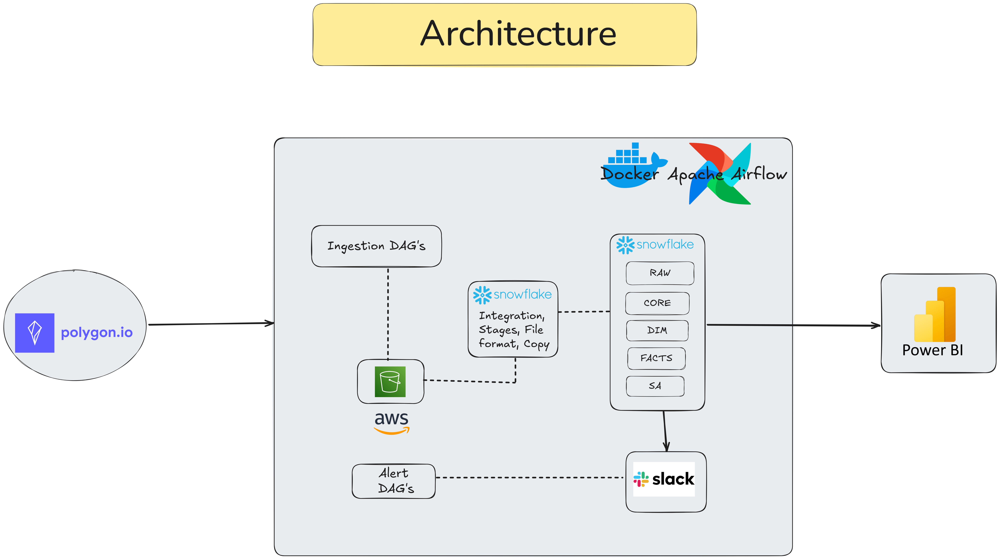

# EOD Securities Pricing Analytics Pipeline

An automated, end-of-day batch pipeline that ingests U.S. equity and ETF pricing data,
transforms it through a layered Snowflake warehouse, and publishes analyst-ready views for
liquidity, sector, and watchlist monitoring — refreshed daily with zero manual work.

## Problem

Reviewing end-of-day market liquidity, sector rotation, ETF performance, and watchlist
momentum is only useful if it happens *before* the next trading session opens. Doing that by
hand — pulling pricing CSVs from a source, cleaning them, and rebuilding a report every
morning — doesn't scale and is easy to get wrong under time pressure. I built this project to
simulate that exact scenario for a buy-side desk: replace the manual CSV-and-spreadsheet
routine with a pipeline that lands fresh pricing data automatically every trading day and
serves up curated, BI-ready views without anyone touching it.

## Architecture



**Flow:** Polygon.io (grouped daily aggregates) → Airflow (Dockerized) ingestion DAG →
S3 (bronze landing) → Snowflake (`COPY INTO` → RAW → CORE → DIM/FACT → SA) → Power BI.
Task failures and daily run summaries post to Slack.

## Tech Stack

| Layer | Technology | Purpose |
|---|---|---|
| Orchestration | Apache Airflow (Docker) | Schedules and sequences the daily batch run |
| Extraction | Python (`requests`) | Pulls grouped daily OHLCV from the Polygon.io API |
| Landing | AWS S3 | Bronze zone for raw CSVs before they reach Snowflake |
| Warehouse | Snowflake | RAW → CORE → DIM/FACT → SA layered model |
| Loading | Snowflake `COPY INTO` via external stage + storage integration | Idempotent, file-history-aware ingestion from S3 |
| Transform | Snowflake SQL `MERGE` | Dedup, upsert, and dimensional modeling |
| Alerting | Slack Incoming Webhook | Task failure alerts + daily run summary |
| BI | Power BI | Liquidity, sector, and watchlist dashboards |

## Repository Structure

```
├── 0_setup/            one-time Snowflake infra: warehouse, DB, schemas, tables,
│                        storage integration, external stage, file format
├── 1_extract/           historical backfill extraction script
│                        (daily extraction logic lives in dags/lib/eod_data_downloader.py,
│                         since Airflow needs it importable alongside the DAG)
├── 2_load/               COPY INTO RAW + freshness check, run every trading day
├── 3_transform/          RAW → CORE → DIM → FACT merge logic, plus the one-time
│                        historical backfill transform
├── 4_dashboarding/       SA (Subject Area) views consumed directly by Power BI
├── dags/                the actual Airflow project: orchestration DAG, connection
│                        test DAGs, and the lib/ package the DAG imports from
├── reject_table_scenario/  a self-contained demo of the negative-volume reject
│                        path: alternate premerge/merge SQL, the reject table DDL,
│                        and a downloader that injects synthetic bad rows for testing
├── resources/            architecture diagram + dashboard screenshots
├── requirements.txt
└── README.md
```

The daily Airflow DAG's `template_searchpath` points at `2_load/` and `3_transform/`
directly, so the SQL lives in one place, organized by pipeline stage, without being
duplicated into a separate `dags/sql/` folder.

## Data Flow

1. **Download** — An Airflow task calls the Polygon.io grouped-daily endpoint for the most
   recent U.S. trading day (walking backward through a lookback window to skip weekends/
   holidays) and writes the result to a local CSV.
2. **Verify** — A follow-up task confirms the CSV actually landed on disk before anything
   downstream runs, so a silent extraction failure can't cascade.
3. **Upload to S3** — The verified CSV is pushed to a dated key under the bronze prefix in S3.
4. **Copy to RAW** — Snowflake's `COPY INTO` reads the file from an external stage (backed by
   a storage integration, not raw AWS keys) into `RAW.RAW_EOD_PRICES`, tagging every row with
   its source file and ingest timestamp for lineage.
5. **Sanity check** — A `SnowflakeCheckOperator` fails the run early if no rows landed for the
   expected trading date.
6. **Pre-merge metrics** — Before touching CORE, the pipeline estimates how many rows will be
   inserted vs. updated, as a lightweight audit trail.
7. **Merge to CORE** — Rows are deduplicated by `(SYMBOL, TRADE_DATE)` — latest ingest wins,
   tie-broken by source file — and upserted into `CORE.EOD_PRICES`.
8. **Dimension maintenance** — `DIM_SECURITY` and `DIM_DATE` are kept in sync by inserting any
   symbols/dates seen in today's CORE load that don't exist yet.
9. **Fact load** — `DM_FACT.FACT_DAILY_PRICE` is upserted at the grain of
   `(SECURITY_ID, DATE_SK)`, joining CORE to both dimensions.
10. **Post-merge metrics + Slack summary** — Row counts are re-validated after the merge, and
    a compact summary (raw rows, estimated inserts/updates, final counts) posts to Slack
    regardless of whether upstream tasks failed, so failures are never silent.
11. **SA (Subject Area) views** — Six business-ready views sit on top of the fact/dim layer:
    daily prices joined to security attributes, top-20 equities by volume, a fixed 10-stock
    watchlist history, trailing 30-day daily returns, latest sector liquidity contribution,
    and a 30-day ETF liquidity screener — these are what Power BI queries directly.

**Negative-volume rejects** aren't part of the default daily path above — that's handled as a
separate, explicit scenario in `reject_table_scenario/`, so the base pipeline stays simple and
the reject-handling design is easy to review on its own. See that folder's files for how
`CORE.EOD_PRICES_REJECT` captures bad rows with a reason code before the valid rows merge into
CORE.

## Key Engineering Decisions

- **Layered warehouse (RAW → CORE → DIM/FACT → SA)** instead of a single flat table, so raw
  landings stay immutable for replay/audit while downstream consumers only ever see cleaned,
  conformed data.
- **Idempotent merges keyed by `(SYMBOL, TRADE_DATE)` and `(SECURITY_ID, DATE_SK)`** so
  re-running a day's DAG never creates duplicates — a hard requirement for a daily batch job
  that will eventually get retried or manually re-triggered.
- **Deterministic dedup ordering** (`_INGEST_TS DESC, _SRC_FILE DESC`) so that if the same
  trading date is ever loaded twice, the pipeline has a reproducible, explainable rule for
  which record wins — not "whichever happened to be inserted last."
- **Reject handling designed as an explicit, opt-in extension** rather than baked into the
  base merge — negative-volume rows are diverted to a dedicated table with a reason code
  instead of being silently dropped, but that logic is isolated so the core daily pipeline
  stays easy to read.
- **Storage integration instead of raw AWS access keys in Snowflake** — Snowflake assumes an
  IAM role via trust policy rather than holding long-lived AWS credentials.
- **Slack summary fires on `all_done`**, not just success, so a failed run still produces a
  visible signal instead of quietly going missing from the channel.
- **SQL organized by pipeline stage, not by DAG task list** — `template_searchpath` accepts
  multiple directories, so the SQL files live under `2_load/` and `3_transform/` where a
  reader would expect to find them, instead of a flat `dags/sql/` folder that hides the
  pipeline's shape.

## Dashboards

**Market Liquidity Overview** — total traded value, symbol coverage, sector contribution,
30-day ETF liquidity trend, and a ranked liquidity table.

 
**Equity Performance & Watchlist Insights** — top-20 equities by volume, daily OHLC, 30-day
average return trend, watchlist price/volume scatter, and top volatile names.


## Running This Yourself

This repo assumes fresh AWS and Snowflake accounts. Before the DAG will run end-to-end:

1. Create an S3 bucket named `kaushik-eodsecurities-data` (or your own name, kept consistent
   everywhere it's referenced).
2. Create an IAM role `kaushik-eodsecurities-s3-role` with a trust policy for Snowflake, and
   fill in your real AWS account ID in `0_setup/snowflake_stage_setup.sql` (currently a
   `<AWS_ACCOUNT_ID>` placeholder — no real account ID is committed to this repo).
3. Run `0_setup/init_snowflake_objects.sql` then `0_setup/snowflake_stage_setup.sql` in
   Snowflake.
4. Set Airflow Variables: `POLYGON_API_KEY`, `S3_BUCKET` (= `kaushik-eodsecurities-data`),
   and optionally `LOOKBACK_DAYS`.
5. Configure Airflow connections: `aws_default`, `snowflake_default`, `slack_default`.
6. Use `dags/test_aws_conn.py`, `dags/test_snowflake_conn.py`, and `dags/test_slack_conn.py`
   to validate each connection independently before triggering the main DAG.


## What I actually built
- A working Airflow DAG (`dags/get_securities_data.py`) that downloads, verifies, uploads to
  S3, and orchestrates an 8-step Snowflake load with explicit task dependencies and a
  `TaskGroup`.
- A layered Snowflake schema (RAW/CORE/DM_DIM/DM_FACT/SA) with idempotent `MERGE` statements
  at every layer.
- A separate, self-contained reject-handling scenario (`reject_table_scenario/`) with its own
  reject table, alternate premerge/merge SQL, and a synthetic-data test fixture to exercise it.
- A storage-integration-based S3 → Snowflake load path (no raw AWS keys in Snowflake).
- Slack alerting on task failure and a daily run summary, wired via `BaseHook` connections
  rather than hardcoded webhook URLs.
- Six curated SA-layer views powering two Power BI dashboards (liquidity overview,
  equity/watchlist performance).
- Standalone connection-test DAGs for AWS, Slack, and Snowflake to validate environment setup
  independently of the main pipeline.


